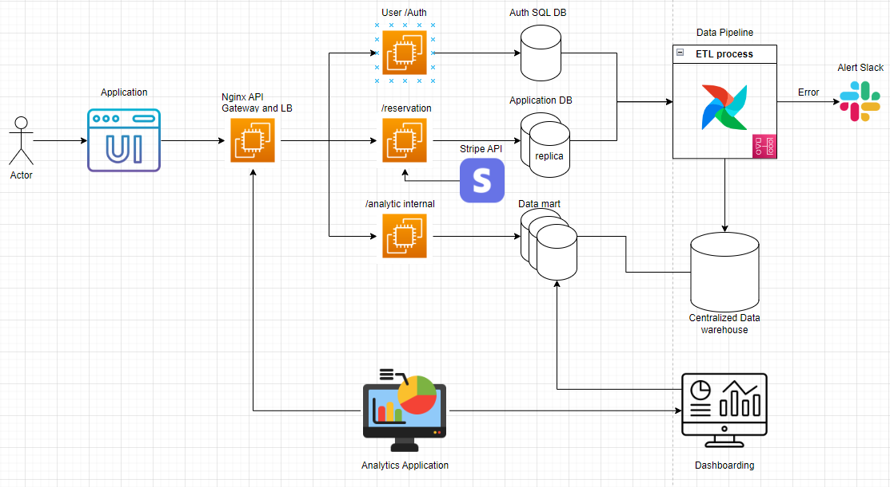

# Parking Reservation System Design
Designed APIs, schema for a parking reservation system.

## Folder Structure

* `database`: Contains database schema in changelog.sql
* `integration`: Contains Express APIs and settings for nginx API gateway
* `terraform`: Contains all resources for deployment

## CI/CD
Github action will deploy the new changes made to the database schema and also run tests for APIs

## System Design
