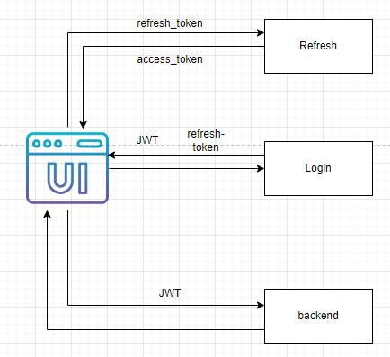

# Auth API
In this Auth API user can login and register a new account. User will receive a JTW access token and a refresh token. JWT Token will be used in Authorization header to retrieve data from the resource server and refresh token is used to retrieve a new JWT token.

## Architecture / Workflow
1. User login and receive a JWT token and a refresh token
2. User can use JWT token to access the resource API server
3. After the token expired, the refresh token will be used to retrieve a new JWT token 

    

## Schema


## Installation
1. Install dependencies
    ```
    cd integration/auth
    npm install
    ```

2. Run the Auth service
   ```
   npm run dev
   ```
3. Go to http://localhost:5001/docs to test endpoints via Swagger API

## Test Auth endpoint
After testing login and registering, you will get a JWT token. Use postman or any other tools to send a get request to http://localhost:5001/test with the JWT as the Authorization header.

## Deployment
[Link](https://parking-reservation.vercel.app/)
